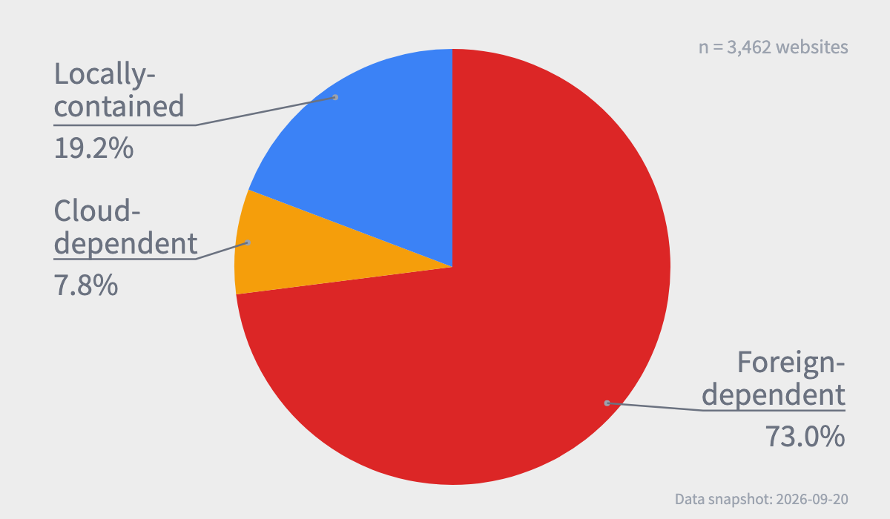

# web-resilience-test-result-kr

Test result dataset for [web-resilience-test-kr](https://github.com/web-resilience-test/web-resilience-test-kr), covering [websites commonly used by people in South Korea](https://github.com/web-resilience-test/top-traffic-website-list-korea), selected from Korean traffic-ranking sources.

The repository stores per-site JSON result files and generated TSV summaries. The existing result files and generated summaries have been cleared so the Seoul FTO hackathon can collect a new Korean dataset.

## Data layout

- `<domain>.json` — result data for one tested website
- `*.tsv` — generated aggregate statistics
- `img/` — generated charts and visual summaries
- `_logs/` — batch test logs and run summaries
- `_error/` — records for sites whose test failed

The test runner and the Korean target list are maintained in the [web-resilience-test-kr](https://github.com/web-resilience-test/web-resilience-test-kr) repository.

## License

This project is dedicated to the public domain under [CC0 1.0 Universal](https://creativecommons.org/publicdomain/zero/1.0/), to the extent permitted by law.

See [LICENSE](LICENSE) for the dedication and legal-code link. See also [`CITATION.cff`](CITATION.cff) for machine-readable citation metadata.
